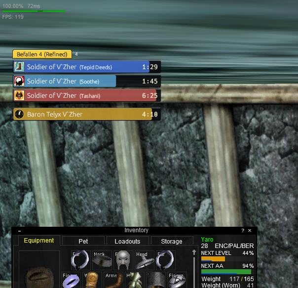
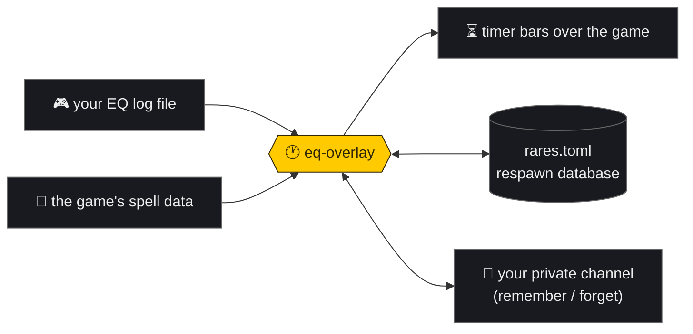

<h1 align="center">🕐 EQ Overlay</h1>

<p align="center">
  
  
  
  <a href="https://github.com/shawnbierman/eq-overlay/releases"></a>
  
</p>

<p align="center"><b>Spell timers and rare-respawn tracking, drawn right over the game.</b><br/>
No memory reading, no packet sniffing, no injection, no automation —<br/>
it just reads files the game writes to disk (your log + the client's spell data).</p>

<p align="center"></p>

**Jump to:** [Setup](#setup) · [What you get](#what-you-get) · [In-game commands](#in-game-commands) · [Build it yourself](#-building-from-source) · [Help](#-troubleshooting)

## Setup

1. **[Download the zip](https://github.com/shawnbierman/eq-overlay/releases)** and unzip it anywhere (Desktop is fine).
2. **Run `eq-overlay-gui.exe`.** Windows will say "unknown publisher" the first time → **More info → Run anyway**.
3. In game: **`/log on`**, and play in **windowed mode**: EQ Options →
   **System → Display** → click **"Switch to Windowed"**. (If the button
   already says "Switch to Fullscreen", you're set.) Overlays can't draw over
   fullscreen mode.

Done. It finds your EQ install by itself and lives in the system tray (🕐 yellow icon = settings). No config files, no triggers to write.

## What you get

- 🪄 **A bar for every debuff you land** — mez, slow, root, DoT… with the real spell icons and level-correct durations, straight from the game's own data. Bars **con like mobs**: green while safe, yellow when short, red when about to break. Cast it, see it. Zero setup.
- ⏰ **Rare respawn timers** — target a named, type `remember %T`, and a countdown clock starts. It **chimes and flashes** when the rare is due, and respawn times calibrate themselves as you camp.
- 🤝 **A portable database** — your rares live in `rares.toml`, plain text you can hand to a friend or fold into the shared list that ships with each release. Commands are **private to you** — nobody else can edit your list.
- 📊 **Zone + live DPS** in a little BeOS-style tab. The overlay never eats your mouse clicks.

## How it works



## In-game commands

Commands go through a channel **named after your character** — private to you, so no one else can touch your list. Set it with **`/autojoin Yaro`** — list it first and it's always channel **`/1`**, every session (add a password to lock it: `/autojoin Yaro:secret`). Then **target a mob** and:

| type | it does |
|---|---|
| `remember %T` | track your target (`%T` = its name) |
| `remember 4:25 %T` | …with the real respawn time |
| `forget %T` | stop tracking it |
| `remember` | track the last mob you killed (no target needed) |
| `zone 9:30` | set THIS zone's default respawn — bare `remember`s here use it (`zone clear` unsets) |

💡 Bind **`/1 remember %T`** to a **hotkey** — one press, no typing. Use `/autojoin` (not `/join`), so the channel keeps the same number every session. Or skip all this and use the **Rares tab** in the settings window: recent kills, one-click add.

<details>
<summary>🔧 <b>Building from source</b> (optional — for devs, or if Smart App Control blocks unsigned exes)</summary>

```powershell
winget install Rustlang.Rustup Microsoft.VisualStudio.2022.BuildTools
git clone https://github.com/shawnbierman/eq-overlay
cd eq-overlay
cargo build --release -p eq-overlay-gui
```

Run the exe from the repo folder (it looks for `config.example.toml` / `rares.toml` beside it). Windows-only: the transparent click-through window needs wgpu/DirectComposition. `cargo test` runs the suite; `cargo run -p eq-cli -- gen --log test.log` fakes log lines so you can try everything without the game.

</details>

<details>
<summary>⚙️ <b>Configuration</b> (you probably never need this)</summary>

A `config.toml` is generated on first run and managed by the settings window — game folder, command channel, sounds, overlay position:

```toml
[general]
log_dir = 'C:\...\EverQuest Legends\Logs'   # newest eqlog_*.txt is followed
command_channel = "Yaro"                     # private; defaults to your character name

[overlay]
x = 20
y = 95
width = 340
height = 480
```

`config.example.toml` documents every key, including custom regex triggers with sound alerts if you want to go full GINA.

</details>

<details>
<summary>🆘 <b>Troubleshooting</b></summary>

- **No bars?** Settings → Status: is it tailing the right character's log? Is `/log on`? EQ must be **windowed** (Options → System → Display → "Switch to Windowed") — nothing can draw over fullscreen.
- **A mez bar flashed and vanished** — the mez broke or didn't stick. The overlay agrees with the log; believe it.
- **New spell rank runs short?** Durations self-correct after the first clean, unbroken wear-off (mote ranks aren't in the game's data files).
- **Windows refuses to run it at all** — that's Smart App Control. Build from source (above).

</details>

<details>
<summary>🔍 <b>What it's doing under the hood</b></summary>

Tails the newest `eqlog_*.txt` (event-driven, ~instant), parses every line, and follows through on your casts: `You begin casting X.` arms the spell's land message from `spells_us.txt`, the land starts a level-scaled bar, wear-off/break/death lines clear it. Same-named mobs share a counted bar (`x2`). Kill lines start respawn countdowns; camped kill-gaps tighten them; zoning wipes everything (fresh instances spawn rares up). It's the GINA model with the trigger-writing automated away.

To be precise about what it touches: it **reads** your log and the client's data files (`spells_us.txt`, `spells_us_str.txt`, the spell-icon sheets) and **writes** its own two files (`config.toml`, `rares.toml`). It never reads game memory, never touches the network, never sends input to the game — the same passive class as GINA, which most emu servers explicitly allow. Check your server's policy if unsure.

</details>

---

<p align="center">MIT licensed · built with Rust + egui · interface lovingly borrowed from BeOS R5</p>
